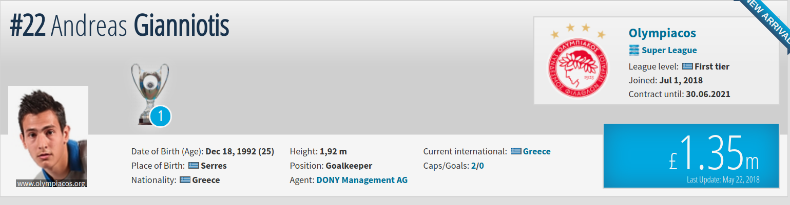

```{r setup, include=FALSE}
knitr::opts_chunk$set(echo = TRUE)
```



A long time ago I had the idea to web scrape penalty data from [Transfer Market](https://www.transfermarkt.co.uk/detailsuche/spielerdetail/suche/7970633). However, my web scraping foo was (and still is) pitiful when JavaScript enters the picture, so this "project" gathered dust for months. Recently though, a solution that I had turned up my nose at suddenly aquired a pleasant aroma. How about I just copy-and-paste all the data? 

A week later the semi-artisanal data was ready. It's fair from comprehensive when compared to other penalty data sets, but at least it exists for me to explore.

```{r, warning=F, message=F}
suppressMessages(library(tidyverse))
suppressMessages(library(knitr))
library(janitor)
library(ebbr)
library(DT)

df <- read_csv("penalties.csv")
head(df) %>%
    knitr::kable()
```

## Imports & Cleaning

Manually copying the data gave me good insight into errors to fix. 

* Encoding of Seasons: Excel transformed some seasons into dates.

* Repitition of Competition Names: I applied a small fix to this, but it wasn't worth going through all the unique ways it expressed itself. This problem came about due to photos in the original table.

* Accents Marks: I stayed clear of this one to be honest.

* Scorelines: Excel encoding these as times (hh:mm:ss) and I removed the seconds, and replaced ':' by '-'.

* Minute Penalty Concended: A simple find and replace sufficed.

* Dates: I increased my problems by using regex as a solution. The fix wasn't complete, but I just added an extra column to mark which dates are not yet in the ISO 8601 format.

With that out of the way, I stored the cleaned data (here's a [link](https://github.com/gfleetwood/soccer-analytics/blob/master/small_projects/penalties/penalties_cleaned.csv)) and began my exploration. I had a simple format: pose a question and find an answer.

```{r, warning=F}
df_cleaned <- df %>%
    mutate(Season = case_when(
        Season == "13-Dec" ~ "12/13",
        Season == "12-Nov" ~ "11/12",
        Season == "10-Sep" ~ "09/10",
        Season == "11-Oct" ~ "10/11",
        Season == "9-Aug" ~ "08/09",
        Season == "8-Jul" ~ "07/08",
        Season == "6-May" ~ "05/06",
        Season == "5-Apr" ~ "04/05",
        Season == "7-Jun" ~ "06/07",
        Season == "4-Mar" ~ "03/04",
        Season == "13-Feb" ~ "12/13",
        Season == "3-Feb" ~ "02/03",
        Season == "11/12/18" ~ "11/12",
        Season == "08/09/18" ~ "08/09",
        Season == "04/05/18" ~ "04/05",
        Season == "12/13/18" ~ "12/13",
        Season == "10/11/18" ~ "10/11",
        Season == "07/08/18" ~ "07/08",
        Season == "06/07/18" ~ "06/07",
        Season == "05/06/18" ~ "05/06",
        Season == "09/10/18" ~ "09/10",
        Season == "03/04/18" ~ "03/04",
        Season == "01/02/18" ~ "01/02",
        Season == "12/13/2018" ~ "12/13",
        Season == "11/12/2018" ~ "11/12",
        Season == "10/11/2018" ~ "10/11",
        Season == "09/10/2018" ~ "09/10",
        Season == "08/09/2018"  ~ "08/09",
        Season == "07/08/2018" ~ "07/08",
        Season == "06/07/2018" ~ "06/07",
        Season == "05/06/2018" ~ "05/06",
        Season == "02/03/18" ~ "02/03",
        TRUE ~ Season  
        )
    ) %>%
    mutate(
        Competition = ifelse(
            str_detect(Competition, '\\?'),
            str_split(Competition, "\\?")[[1]][1],
            Competition
            )
    ) %>%
    mutate(
        Minute = str_remove_all(Minute, "'"),
        Minute = ifelse(Minute == '', NA, Minute),
        Minute = as.integer(Minute)
    ) %>%
    mutate(
        # The score were stored as times (hh:mm:ss) so [-3] removes the seconds representation
        `Final result` = map(str_split(`Final result`, ":"), 
                             function(x) x[-3] %>% paste(collapse = '-')) %>% unlist(),
        `Score At This Time` = map(str_split(`Score At This Time`, ":"), 
                                   function(x) x[-3] %>% paste(collapse = '-')) %>% unlist()
    ) %>%
    mutate(
        Date = case_when(
            # Dates with "-"
            str_detect(Date, "[[:digit:]]{2}-[[:digit:]]{2}-[[:digit:]]{4}") ~ 
                format(strptime(Date, format = "%m-%d-%Y"), "%Y-%m-%d"),
            str_detect(Date, "[[:digit:]]{2}-[[:digit:]]{2}-[[:digit:]]{2}") ~ 
                format(strptime(Date, format = "%m-%d-%y"), "%Y-%m-%d"),
            str_detect(Date, "[[:digit:]]{1,}-[[:alpha:]]{1,}-[[:digit:]]{2}") ~ 
                format(strptime(Date, format = "%d-%b-%y"), "%Y-%m-%d"),
            # Dates with "/"
            str_detect(Date, "[[:digit:]]{2}/[[:digit:]]{2}/[[:digit:]]{4}") ~ 
                format(strptime(Date, format = "%m/%d/%Y"), "%Y-%m-%d"),
            str_detect(Date, "[[:digit:]]{2}-[[:digit:]]{2}-[[:digit:]]{2}") ~ 
                format(strptime(Date, format = "%m/%d/%y"), "%Y-%m-%d"),
            str_detect(Date, "[[:digit:]]{1,}-[[:alpha:]]{1,}-[[:digit:]]{2}") ~ 
                format(strptime(Date, format = "%d/%b/%y"), "%Y-%m-%d"),
            TRUE ~ Date
        ),
        Date = as.Date(Date),
        MalformedDate = ifelse(is.na(Date), 1, 0)
    ) %>%
    clean_names() %>%
    rename(
        goal_keeper = player
    )

head(df_cleaned) %>%
    knitr::kable()
#write_csv(df_cleaned, "penalties_cleaned.csv")
```

## What's The Overall Conversion Rate?

77.66% of the penalties in this data set were scored. This is a bit higher than the percentage usually referenced in the soccer analytics community.

```{r}
df_cleaned$saved %>% tabyl() %>%
    knitr::kable()
```

## Who Are The Best Goalkeepers?

Answering this question the naive way showed Yuri Lodygin topping the charts withh a save percentage of 53%. A slight look to the right cast a shadow over this ranking as Lodygin only faced 13 penalties. There were more impressive numbers in the top 10 from this dual perspective. 

Unsurprisingly, one pair belongs to Diego Alves, a man well known for his penalty saving exploits. However, his 44.6% save rate from 56 penalties put him below the relatively unknown - at least to me - Ales Smithies who has a 45.5% save rate from 44 penalties faced.  

```{r}
df_cleaned %>% 
    group_by(goal_keeper) %>% 
    summarise(
        save_percentage = mean(saved),
        number_of_penalties = n()
        ) %>%
    arrange(desc(save_percentage)) %>%
    head(10) %>%
    knitr::kable()
```

The non-naive approach leveraged simple Bayesian analysis. The `.fitted` column shows this updated ranking with Diego Alves and Alex Smithies at the top.

```{r}
df_cleaned %>% 
    group_by(goal_keeper) %>%
    summarise(
        penalties_faced = n(),
        saves = sum(saved)
    ) %>% 
    ungroup() %>%
    add_ebb_estimate(saves, penalties_faced) %>% 
    arrange(desc(.fitted)) %>% 
    head(10) %>%
    knitr::kable()
```

## Who Are The Best Penalty Takers?

What about the takers themselves? Again we see players with small samples leading the pack.

```{r}
df_cleaned %>% 
    group_by(penalty_taker) %>% 
    mutate(converted = ifelse(saved==1, 0, 1)) %>%
    summarise(
        conversion_percentage = mean(converted),
        number_of_penalties = n()
        ) %>%
    arrange(desc(conversion_percentage)) %>%
    head(10) %>%
    knitr::kable()
```

But Bayesian analysis revealed the true masters. One word: Zlatan.

```{r}
df_cleaned %>% 
    group_by(penalty_taker) %>%
    mutate(converted = ifelse(saved==1, 0, 1)) %>%
    summarise(
        penalties_taken = n(),
        penalties_scored = sum(converted)
    ) %>% 
    ungroup() %>%
    add_ebb_estimate(penalties_scored, penalties_taken) %>% 
    arrange(desc(.fitted)) %>%
    head(10) %>%
    knitr::kable()
```

## What Are The Most Frequent Battles?

When it comes to matchups five goal keeper x penalty taker pairs topped the list with five duels. Two stand out: Buffon against Totti with two saves for Buffon, and the aforementioned Diego Alves with 1/5 penalties saved against Lionel Messi.

```{r}
df_cleaned %>%
    mutate(
        match_ups = paste(df_cleaned$goal_keeper, df_cleaned$penalty_taker, sep = ' x ')
    ) %>%
    group_by(match_ups) %>%
    summarise(
        duels  = n(),
        saved_penalties = sum(saved)
    ) %>% 
    arrange(desc(duels), desc(saved_penalties)) %>%
    head(10) %>%
    knitr::kable()
```

## Which Clubs Conceded The Most Penalties?

That unfortunate stat belongs to Udinese.

```{r}
df_clubs <- df_cleaned %>% 
    group_by(club) %>%
    count() %>%
    arrange(desc(n))

df_clubs[1:10, ] %>%
    knitr::kable()
```

## Which Competition Saw The Most Penalties?

When it comes to a top 10 of most penalties given, La Liga leads the rest of the pack by a considerable ammount.

```{r}
df_competition <- df_cleaned %>% 
    group_by(competition) %>% 
    count() %>% 
    arrange(desc(n))

df_competition[1:10, ] %>%
    knitr::kable()
```

## Most Frequency Score When Penalty Conceded?

A lazy solution gives me the answer quite quickly. Instead of accounting for the symmetry in scores, i.e that 1x0 and 0x1 are the same, a table shows me that the aforementioned scorelines are number 1 and 3 in an unbalanced ranking, thus making it pretty clear that the most frequent scoreline when a penalty is given is 1x0. Not that this says much, since that's also probably [the most frequent scoreline in soccer](https://fivethirtyeight.com/features/in-126-years-english-football-has-seen-13475-nil-nil-draws/).

```{r}
df_cleaned %>% 
    group_by(score_at_this_time) %>% 
    count() %>% 
    arrange(desc(n)) %>%
    head() %>%
    knitr::kable()
```

## Goalkeeper's Team Position When Penalty Given?

Interestingly enough, most penalties are conceded when the goalkeepers is losing. This makes sense intuitively given score effects. A losing team is more likely to be pushing forward and thus more prone to desperate defending. This hypothesis does fall a bit flat when the average minute of conceding the penalty enters the frame. The 50th minute is hardly a call for kamikaze attacking. (Or maybe it is depending on how much the team is losing by.)

I'm not sure what to say about the gulf in save percentages. 

```{r, warning=F}
df_cleaned %>%
    separate(score_at_this_time, c("team_1_score", "team_2_score"), remove = F) %>%
    mutate(
        team_1_score = as.integer(team_1_score),
        team_2_score = as.integer(team_2_score),
        in_the_lead = case_when(
            team_1_score > team_2_score ~ team_1,
            team_1_score < team_2_score ~ team_2,
            team_1_score == team_2_score ~ 'D'
        ),
        gk_team_pos = case_when(
            in_the_lead == 'D' ~ 'D',
            club == in_the_lead ~ 'W',
            TRUE ~ 'L'
        )
    ) %>% 
    group_by(gk_team_pos) %>%
    summarise(
        num_penalties = n(),
        save_percentage = mean(saved),
        minute_average = round(mean(minute, na.rm = T))
    ) %>% 
    arrange(desc(num_penalties)) %>%
    knitr::kable()
```

## In Closing

This was a pretty good data exploration exercise. I'm looking forward to the day when I can work with some Opta penalty data to incorporate information like the dominant foot and hand of the taker and goalkeeper respectively, and the position of the shot in relation to the goal. I'm not sure if this exists yet, but technique is something I'm been mulling over as well, i.e if the penalty taker is goalkeeper dependent or just picks a side. 